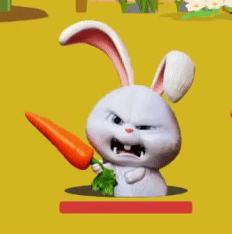
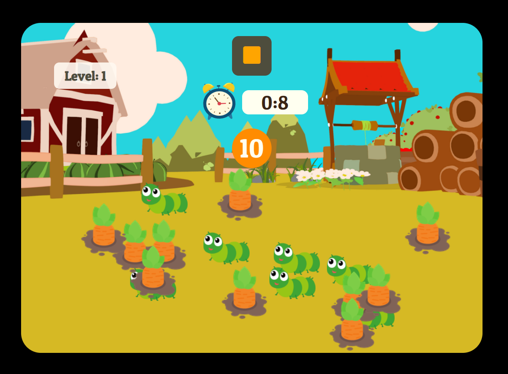

merry.github.io

<h1 align="center"><b>Carrot Game</b></h1>
<p align="center">


</p>
  
<h2 align="center"><a href="https://noma98.github.io/Carrot-Game/"><b>Live Demo</b></a></h2>

---

## **Description**

세가지의 라운드로 구성되어 있고 레벨이 증가할수록 난이도가 높아집니다. 방해물(벌레, 토끼 등)을 피해 당근을 주어진 시간내에 모두 클릭하면 승리하는 게임입니다.

**이 프로젝트는 드림코딩 아카데미의 미니 프로젝트 중 하나로 디자인 및 기능을 확장/변형한 버전입니다.**

## **How to play**

### Click the carrots! (Level 1-2)

 

- 당근을 **클릭**하세요.
- 벌레나 토끼를 클릭하게 되면 게임에서 지게됩니다.

### Hit the boss rabbit! (Level 3)



- 보스몹을 클릭할수록 피가 줄게 됩니다.
- 피가 모두 닳으면 분노가 정화된 토끼가 자신이 가진 당근을 놓아줍니다.
- 당근을 **클릭**하세요.

# **About the project.**

Development Environment : HTML, CSS, Vanilla JS, vscode, github  
자세한 코드 확인은 [이곳](https://github.com/MerryHa/Carrot-Game/tree/main/src)을 이용하세요.

### **Field Click Event & This Binding**

- 일일이 자식노드에 추가하기 보다는 Event delegation으로 gameField(부모노드) 자체에 addEventListener를 등록하여 Click에 대한 동일한 로직들을 처리하였습니다.

```js
this.field.addEventListener('click', this.onClick);
```

- 멤버함수를 addEventListener의 콜백으로 전달할 때 클래스 정보는 같이 전달이 안되므로 onClick함수를 멤버변수로 변형하여 함수와 클래스를 바인딩해주었습니다.

```js
onClick = (event) => {
  const target = event.target;
  switch (target.className) {
    case 'carrot':
      target.remove();
      sound.playCarrot();
      this.onItemClick && this.onItemClick(true, this.carrotCount);
      break;
    case 'bug':
    case 'rabbit':
      this.onItemClick && this.onItemClick(false, this.carrotCount);
      break;
    case 'boss__img':
      sound.playHit();
      this.bleeding(target);
      break;
    case 'lost-boss__carrot':
      sound.playGetCarrot();
      target.parentNode.classList.add('hidden');
      this.onItemClick && this.onItemClick(true, this.bossCount);
      break;
  }
};
```

### **Builder Pattern**

- Game class를 만들때 5가지 인자를 받아야하므로 Builder pattern을 이용해 직관적으로 코드를 읽을 수 있도록 하였습니다.

```js
//main.js
import { GameBuilder, Reason } from './game.js';
const game = new GameBuilder()
  .withGameDuration(10)
  .withCarrotCount(10)
  .withBugCount(7)
  .withRabbitCount(5)
  .withBossCount(3)
  .build();

//game.js
export class GameBuilder {
  withGameDuration(duration) {
    this.gameDuration = duration;
    return this;
  }
  withCarrotCount(num) {
    this.carrotCount = num;
    return this;
  }
  withBugCount(num) {
    this.bugCount = num;
    return this;
  }
  withRabbitCount(num) {
    this.rabbitCount = num;
    return this;
  }
  withBossCount(num) {
    this.bossCount = num;
    return this;
  }
  build() {
    return new Game(
      this.gameDuration,
      this.carrotCount,
      this.bugCount,
      this.rabbitCount,
      this.bossCount
    );
  }
}
```

### **Game Timer**

 

- global scope에서 `let timer=undefined;`로 정의 후 block scope에서 setInterval 함수를 `timer`에 재정의함으로써 바깥에서도 clearInterval 하는 것이 가능하도록 하였습니다.

```js
startGameTimer(){
        let remainingTimeSec=this.gameDuration;
        if(this.level===3){
            remainingTimeSec*=2;
        }
        this.clockRing(remainingTimeSec);
        this.updateTimerText(remainingTimeSec);
        this.timer=setInterval(() => {
            if(remainingTimeSec<=0){
                clearInterval(this.timer);
                this.stop(this.carrotCount===this.score?Reason.win:Reason.lose);
                return;
            }else{
                this.updateTimerText(--remainingTimeSec);
            }
        }, 1000);
    }
```

- setTimeout을 이용해 타이머 옆 시계를 class로 토글링하여 타이머가 끝날 시간이 가까워지면 빠르게 울리도록 하였습니다.

```js
clockRing(time){
        let almostTimeToFinish=time*0.7*1000;
        this.clock.className='clock ring';
        this.clockSetTimeout=setTimeout(() => {
            sound.playClock();
            this.clock.className='clock ring-fast';
            this.clock.setAttribute('src','img/clock-ring.png');
        }, almostTimeToFinish);
    }
```

### **Remained blood**

- 보스몹의 피를 HTML에서 `data-blood=100`이라고 data-\* 속성을 통해 정의하였습니다
- 보스 이미지를 클릭할때마다 event.target의 nextSibling과 childNodes를 통해 해당 target의 피를 깎을 수 있도록 연결하였습니다.

```js
bleeding(target){
        const targetBloodBox=target.nextSibling.nextSibling;
        const targetBlood=targetBloodBox.childNodes[1];
        let blood=targetBlood.dataset["blood"];
        blood-=10;
        targetBlood.dataset["blood"]=blood;
        targetBlood.style.width=`${blood}%`;
        if(blood===0){
            target.parentNode.innerHTML=`
                <div class="lost-boss">
                
                
                </div>`;
        }
    }
```

### **3 Rounds**

- 게임은 3개의 Round로 이루어져 있고 Game class의 멤버변수로 정의되어 있는 level과 score 변수를 통해 레벨 계산이 이루어집니다.
- Round 1
  

- Round 2
  

- Round 3
  

# **Future scope**

- 벌레와 토끼를 랜덤한 영역으로 돌아다니게 하기
- 보스몹을 때릴때 마우스를 무기 모양으로 변경하기
- 당근위를 hover할 때 주먹을 쥐었다 피었다 하는 모양으로 마우스 변경하기
- 좀 더 완벽하게 중앙 정렬 및 반응형으로 만들기
